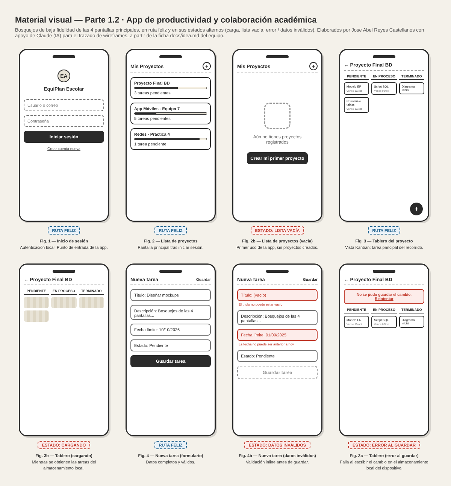
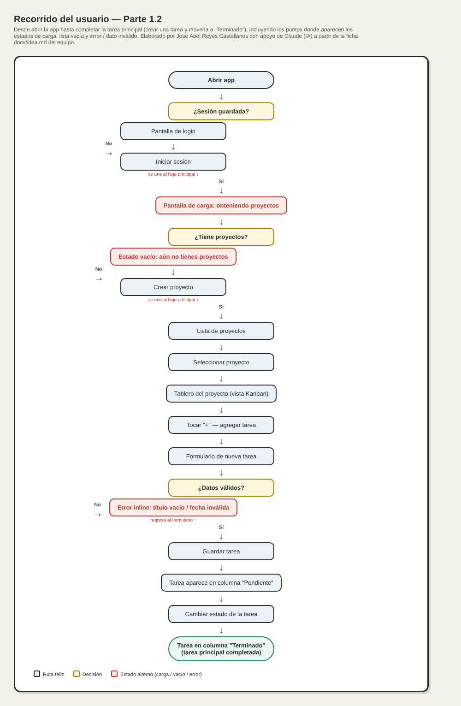

# Parte 1: Idea original de la aplicación

En esta parte se presenta la aplicación que quiere construir. 

## 1.1 Ficha de idea

* **Ruta elegida y motivo:** 
  * *Ruta:* Productividad y Colaboración Académica.
  * *Motivo:* Facilitar la organización de equipos de trabajo universitarios para evitar la desorganización, la duplicidad de tareas y los retrasos en las entregas de proyectos escolares.
* **Usuario y contexto:** 
  * *Quién:* Estudiantes universitarios y miembros de equipos de desarrollo o proyectos académicos.
  * *Dónde y cuándo:* Desde sus teléfonos celulares, en cualquier momento y lugar, ya sea durante las clases presenciales, reuniones de equipo a distancia o antes de la fecha límite de entrega de una tarea.
* **Problema observable:** Los estudiantes universitarios frecuentemente enfrentan dificultades para coordinar proyectos en equipo debido a la falta de un seguimiento claro de pendientes, lo que provoca que las tareas se concentren en una sola persona o se entreguen fuera de tiempo.
* **Alternativa actual:** Uso de chats grupales de mensajería instantánea (como WhatsApp) donde los acuerdos se pierden, o bien herramientas de escritorio complejas (como Trello o Jira en versión web) que no están optimizadas para consultas rápidas desde el celular.
* **Tarea principal del usuario:** Crear un equipo de trabajo, agregar tareas con fechas límite y actualizar el estatus de sus pendientes (*Pendiente, En Proceso, Terminado*).
* **Criterio de éxito:** El usuario puede crear una nueva tarea dentro de su proyecto y cambiar su estatus en menos de 30 segundos desde la interfaz móvil.
* **Alcance de la primera versión (MVP):** 
  * *Entra:* Autenticación local de usuario, creación de proyectos y tableros de tareas, asignación de estados (*Pendiente, En Proceso, Terminado*) y establecimiento de fechas límite.
  * *Se aplaza de forma deliberada:* Notificaciones push en tiempo real vía servidores externos, chat integrado dentro de la aplicación y sincronización avanzada en la nube con múltiples dispositivos.

## 1.2 Material visual de la idea

* **Bosquejos de las 4 pantallas principales (ruta feliz + estados alternos):**

  1. *Inicio de sesión (Fig. 1):* autenticación local, punto de entrada de la app.
  2. *Lista de proyectos (Fig. 2 / Fig. 2b):* pantalla principal tras iniciar sesión; estado alterno de *lista vacía* cuando el usuario aún no tiene proyectos.
  3. *Tablero del proyecto (Fig. 3 / Fig. 3b / Fig. 3c):* vista Kanban (Pendiente/En proceso/Terminado), tarea principal del recorrido; estados alternos de *carga* y de *error al guardar*.
  4. *Nueva tarea (Fig. 4 / Fig. 4b):* formulario de creación con título, descripción, fecha límite y estado; estado alterno de *datos inválidos*.

* **Diagrama del recorrido del usuario (User Flow):**

  `Abrir app` $\rightarrow$ `Inicio de sesión` $\rightarrow$ `Lista de proyectos` $\rightarrow$ `Seleccionar proyecto` $\rightarrow$ `Tablero del proyecto` $\rightarrow$ `Nueva tarea` $\rightarrow$ `Guardado y actualización de estatus` $\rightarrow$ `Fin de la tarea principal`.

* **Estados alternativos (señalados en los bosquejos y en el diagrama):**
  * *Carga:* indicador al abrir un proyecto, mientras se obtienen sus tareas del almacenamiento local.
  * *Lista vacía:* mensaje "Aún no tienes proyectos registrados" con botón de acción, si el usuario no tiene proyectos.
  * *Error:* aviso "No se pudo guardar el cambio" con opción de reintentar, si falla la escritura en el almacenamiento local del dispositivo.
  * *Datos inválidos:* alerta en línea, en rojo, al intentar guardar una tarea con el título vacío o una fecha límite retroactiva.

* **Autoría y uso de IA:** bosquejos y diagrama elaborados por Jose Abel Reyes Castellanos con apoyo de Claude (Anthropic) para el trazado de los wireframes (HTML/CSS) y del diagrama de flujo, a partir del contenido ya definido por el equipo en la sección 1.1. El contenido, la terminología y las decisiones de producto son del equipo.

## 1.3 Historia de usuario y criterio de aceptación

* **Historia de usuario principal:**
  > **Como** estudiante universitario integrante de un equipo de proyecto,  
  > **quiero** agregar y actualizar el estatus de las tareas asignadas dentro de la aplicación móvil,  
  > **para** mantener a mis compañeros informados sobre el avance y cumplir con la fecha de entrega.

* **Criterio de aceptación:**
  > **Dado** que el usuario se encuentra dentro del tablero de tareas de su proyecto,  
  > **cuando** presiona el botón de añadir tarea, llena los campos requeridos (título y fecha límite) y confirma la acción,  
  > **entonces** la nueva tarea aparece reflejada inmediatamente en la lista con el estatus de "Pendiente".

* **Verificabilidad:** Cualquier evaluador puede abrir la aplicación, navegar a un proyecto, crear una tarea con datos válidos y comprobar de manera visual que esta se añade de forma correcta al tablero.
